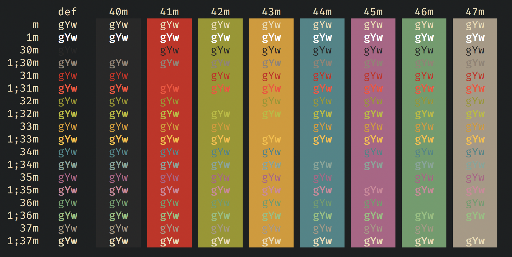

# Gruvbox Dark Hard Theme for iTerm2

This theme is a slightly modified version of the [Gruvbox Dark](https://raw.githubusercontent.com/mbadolato/iTerm2-Color-Schemes/master/schemes/Gruvbox%20Dark.itermcolors) theme from [iterm2colorschemes](https://github.com/mbadolato/iTerm2-Color-Schemes).

# Screenshot

This screenshot was generated using [this](https://github.com/mbadolato/iTerm2-Color-Schemes/blob/master/tools/screenshotTable.sh) script.

# Installation

Download the `.itermcolours` file and use import it in iTerm2. Check out this [guide](https://github.com/mbadolato/iTerm2-Color-Schemes#installation-instructions) for a more detailed explanation.